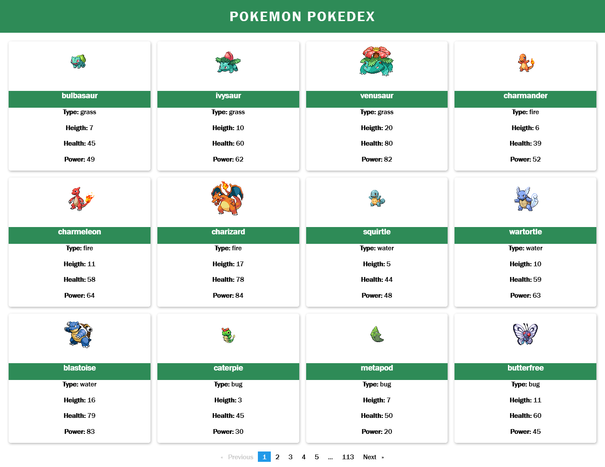

# Pokemon Pokedex

Another quick project to learn some Angular api stuff.

Made using the fantastic and free PokéAPI https://pokeapi.co/

Live demo at: https://pokemon-pokedex-angular.vercel.app/

 

## How It's Made:

**Tech used:** HTML, CSS, TypeScript, Angular 13

Another small project to teach myself Angular.
Made using the PokéAPI, it will display 12 pokemons by default on each page.
I had to make a few quick fixes to arrange pokemons so it doesn't look bad.

## Optimizations

- CSS is almost non-existant. It will get worked in the future.

- Display cards colours according to the pokemon type.

- Clean the code a bit more and optimize the sorting of pokemons.

- Add a search option, it should be easy.

## Lessons Learned:

I almost left bulbasaur behind because i was starting to count from 1 and this guy is 0. Sry little guy :(.

Read the API docs thoughly to avoid mistakes.

Am I weird if i like flexbox more than grid?